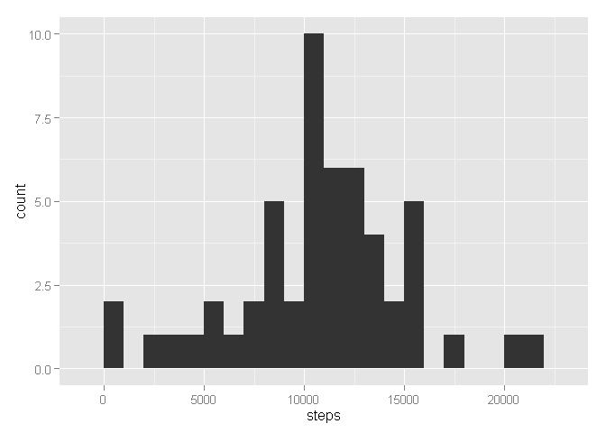
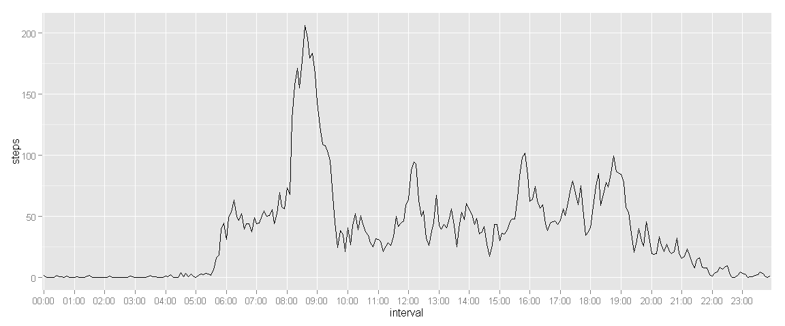
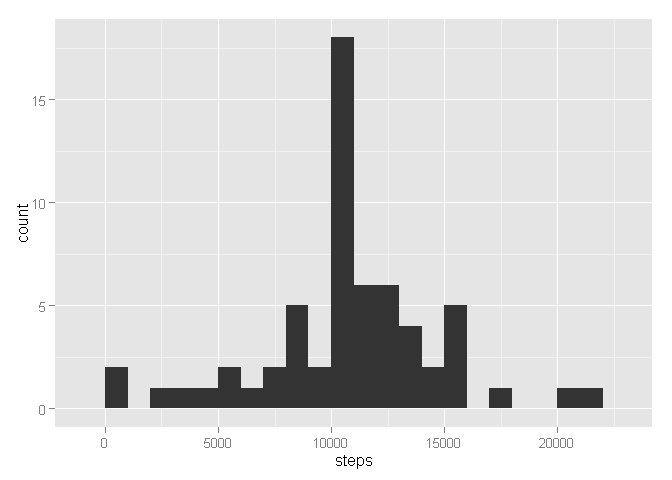
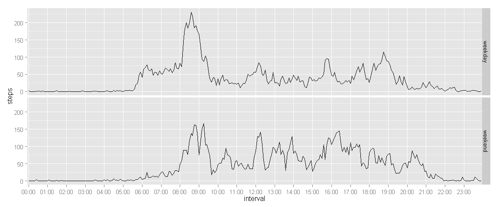

# Reproducible Research: Peer Assessment 1

## Loading and preprocessing the data


```r
library(ggplot2)
library(knitr)
setwd('c:/docs/git/RepData_PeerAssessment1')
data<-read.csv('activity.csv')
temp <- mapply(function(x, y) paste0(rep(x, y), collapse = ""), 0, 4 - nchar(data$interval))
data$interval <- paste0(temp, data$interval)
data$interval<-format(strptime(data$interval, format="%H%M"), format = "%H:%M")
```

## What is mean total number of steps taken per day?

Making a histogram of the total number of steps taken each day. Note that the days that contain only missing values will be omitted.


```r
dailysteps<-aggregate(steps ~ date, data = data, na.rm = TRUE, sum)
qplot(steps, data = dailysteps, binwidth=1000)
```

 

### Calculating mean & median:


```r
mean(dailysteps$steps)
```

```
## [1] 10766
```

```r
median(dailysteps$steps)
```

```
## [1] 10765
```

## What is the average daily activity pattern?

now let's look at interval means


```r
dap<-aggregate(steps ~ interval, data = data, na.rm = TRUE, mean)
qplot(interval, steps, data = dap, group = "interval", geom="line") + scale_x_discrete(breaks = dap$interval[seq(1,length(dap$interval), 12)])
```

 

let's find the interval that contains the maximum number of steps:


```r
dap[which.max(dap$steps), 1]
```

```
## [1] "08:35"
```

well, seems to be correct (according to the plot :))

## Imputing missing values

Let's count all the missing values:


```r
sum(is.na(data))
```

```
## [1] 2304
```

Now let's replace all missing values with average number of steps for appropriate interval:


```r
newdata<-data
for(i in seq(1:nrow(newdata))){
    if (is.na(newdata$steps[i])){
        newdata$steps[i]=dap[dap$interval == newdata$interval[i],2]
    }
}
```

Let's look on the new histogram:


```r
newdailysteps<-aggregate(steps ~ date, data = newdata, sum)
qplot(steps, data = newdailysteps, binwidth=1000)
```

 

Much more 10000-steps-days than before.

Let's calculate mean & median:


```r
mean(newdailysteps$steps)
```

```
## [1] 10766
```

```r
median(newdailysteps$steps)
```

```
## [1] 10766
```

## Are there differences in activity patterns between weekdays and weekends?

First, add a factor variable with two levels - "weekday" and "weekend"


```r
Sys.setlocale("LC_TIME","English United States")
```

```
## [1] "English_United States.1252"
```

```r
newdata$weekday<-weekdays(as.Date(newdata$date))
newdata$weekday[newdata$weekday %in% c("Monday", "Tuesday", "Wednesday", "Thursday", "Friday")]<-"weekday"
newdata$weekday[newdata$weekday %in% c("Saturday", "Sunday")]<-"weekend"
newdata$weekday<-as.factor(newdata$weekday)
```

Then, let's draw some plots:


```r
weekdata<-aggregate(steps ~ interval + weekday, data = newdata, mean)
qplot(interval,steps,data = weekdata, group = "interval", geom="line")+scale_x_discrete(breaks = weekdata$interval[seq(1,length(weekdata$interval), 12)])+facet_grid(weekday~.)
```

 
